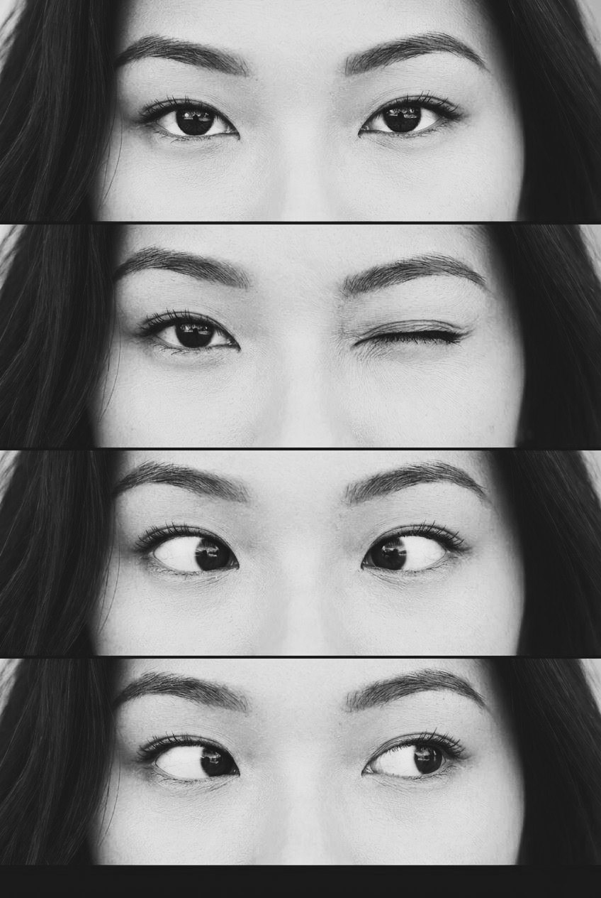

👁️ Freize Eyes – Vertical Wallpaper Generator from Multiple Photos
Freize Eyes is a modern web application that lets you combine 2–6 vertical photos (perfect for eye/face close-ups) into a single, seamless vertical wallpaper for your phone. It provides an intuitive cropping experience, smart resolution detection, and real-time preview.

✨ Key Advantages
📱 Adaptive Design & Mobile First
Works flawlessly on smartphones, tablets, and desktop browsers (touch‑friendly with pinch‑to‑zoom).
Automatically detects the user’s device (iPhone, Samsung, Pixel, Xiaomi, Huawei, OnePlus, etc.) and suggests the optimal screen resolution.
Includes a floating “scroll to top” button for long pages.

🖼️ Smart Photo Management
Start with 1 photo and dynamically add up to 6 images – no pre‑defined limits.
Each photo has its own Cropper.js instance for precise manual cropping (move, zoom, rotate).
Default crop area covers the entire image width – adjust as needed.

🔧 Real‑time Feedback & Recommendations
Fill indicator shows how much of the wallpaper height is occupied by your cropped photos (ideal range: 85–95%).
Visual progress bar and percentage warnings if the total height is too low (<70%) or too high (>98%).
Before generating, the app warns you if the filling is suboptimal and suggests adjustments.

📐 Height Synchronization
“Sync Height” button – instantly equalises the crop height of all loaded photos to the average value, ensuring uniform block sizes in the final wallpaper.
Makes multi‑photo layouts look perfectly organised.

🎨 Customisation Options
Wallpaper format: choose from 20+ pre‑defined resolutions grouped by brand (Apple, Samsung, Google Pixel, Xiaomi, Huawei, OnePlus, plus standard HD/WQHD).
Colour filters: original, black & white, sepia, vintage, cool – applied to the final image.
Separator thickness: 6px, 10px, or 16px black lines between photos.
Output format: download as PNG (lossless) or JPEG (92% quality).

🌍 Multilingual Interface
Fully translated into English, Russian, and Simplified Chinese.
Switch languages on the fly – all UI elements, tips, and option labels update immediately.

🔄 Automatic Height Adjustments
If the combined height of all scaled photos plus separators exceeds the target resolution, the app automatically crops from the bottom of the photos to fit exactly.
If the total height is less than the target, black padding is added at the bottom.

🧩 Clean, Accessible UI
Clearly grouped settings: screen resolution, colour filter, separator.
Secondary row with two large action buttons (Sync Height + Generate).
Hint section with step‑by‑step instructions (vertical layout, no duplicate emojis).
Styled file input buttons that work on all browsers.

⚡ Performance & Privacy
100% client‑side – no server uploads, your photos never leave your device.
Uses Cropper.js for smooth cropping and TensorFlow.js is not required (no AI model downloads, works offline after first load).
Lightweight, fast, and responsive.

🚀 Ready for GitHub Pages
Pure HTML/CSS/JS – no build step. Just clone and open index.html.
Easy to deploy on GitHub Pages, Netlify, or any static hosting.

🎯 Use Cases
Create personalised phone wallpapers from selfies, eye close‑ups, or any vertical photos.
Perfect for social media challenges (“freize eyes” trend).
Quickly combine product photos or portrait sequences.

📸 Screenshots (add to your repo)
Upload & crop each photo individually.
Adjust settings – resolution, filter, separator.
Check fill indicator – aim for 85‑95%.
Generate & download as PNG or JPEG.

💡 Why Choose Freize Eyes?
Feature	Benefit
Dynamic photo count	Add exactly as many photos as you need (up to 6).
Auto‑detected resolution	No need to search for your phone’s specs.
Fill recommendation	Avoids wasted space or awkward cropping.
Height sync	Uniform blocks for a professional look.
Multilingual	Accessible to a global audience.
No backend	Private, fast, and free to host.

🔗 Live Demo & Repository
Live Demo: https://eyes.freize.net/index.html
